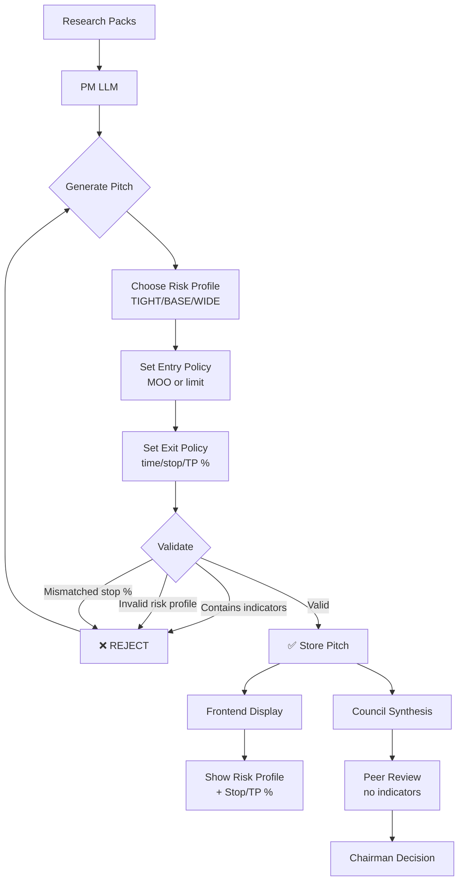
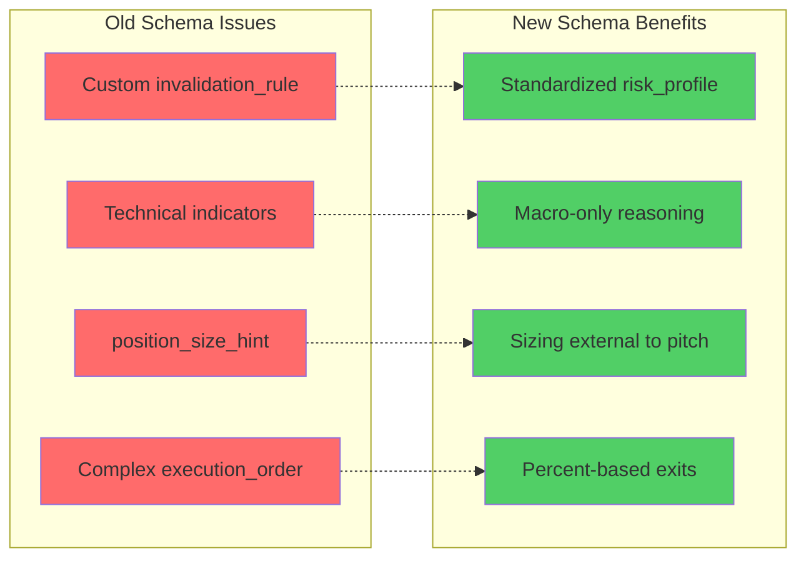

# PM Pitch Schema v2 - Risk Normalization & Clean Execution

## Overview

This plan implements a major schema upgrade to enforce **risk normalization**, **clean execution semantics**, and **strict separation between trade selection and position sizing**. The changes eliminate custom risk parameters, ban technical indicators, and standardize the PM pitch format to produce cleaner training data for RL agents.

### Background

The current PM Pitch schema allows:
- Custom `invalidation_rule` (free-form text)
- Technical `indicators` (RSI, MACD, etc.)
- `position_size_hint` (PMs controlling sizing)
- Complex `execution_order` with nested `contingent_stop_loss`

This creates **inconsistency across PMs** and **pollutes RL training signals** with indicator-based logic.

### Objectives

1. **Standardize risk expression** via three profiles (TIGHT/BASE/WIDE)
2. **Ban technical indicators** to force macro/fundamental reasoning
3. **Simplify execution schema** to broker-ready format with percent-based exits
4. **Separate sizing from signal** (PMs choose trades, system chooses size)
5. **Enforce strict validation** with `additionalProperties: false`

---

## Task 1: Update Execution Order Schema

### Goal
Replace `/research/llm_trading/schemas/execution_order.schema.json` with the simplified broker-ready format from the specification.

### Changes Required

**Remove:**
- `contingent_stop_loss` object (stops computed at execution time)
- `stop` and `stop_limit` order types (v1 uses market/limit only)
- `gtc` time-in-force (v1 uses day orders only)

**Add:**
- `exit_policy` object with required fields:
  - `time_stop_days` (integer, enum: [7])
  - `stop_loss_pct` (number, min: 0.005, max: 0.05)
  - `take_profit_pct` (number|null, min: 0.005, max: 0.10)
  - `exit_before_events` (array of strings: NFP/CPI/FOMC)
- Strict symbol enum: `["SPY", "QQQ", "IWM", "TLT", "HYG", "UUP", "GLD", "USO", "VIXY", "SH"]`
- `additionalProperties: false` for strict validation

**Schema Structure:**
```json
{
  "$schema": "http://json-schema.org/draft-07/schema#",
  "$id": "https://llm-trading.local/schemas/execution_order.schema.json",
  "title": "Execution Order Schema",
  "type": "object",
  "additionalProperties": false,
  "required": ["symbol", "side", "order_type", "time_in_force", "limit_price", "exit_policy"],
  "properties": {
    "symbol": { "type": "string", "pattern": "^(SPY|QQQ|IWM|TLT|HYG|UUP|GLD|USO|VIXY|SH)$" },
    "side": { "type": "string", "enum": ["buy", "sell"] },
    "order_type": { "type": "string", "enum": ["market", "limit"] },
    "time_in_force": { "type": "string", "enum": ["day"] },
    "limit_price": { "type": ["number", "null"], "minimum": 0 },
    "exit_policy": { /* ... as specified ... */ }
  }
}
```

### Files to Modify
- `/research/llm_trading/schemas/execution_order.schema.json`

---

## Task 2: Create Risk Profile Constants

### Goal
Define standardized risk profiles as Python constants for use in validation and execution.

### Implementation

Create or update a constants file (suggest `/research/llm_trading/backend/pipeline/constants.py` or inline in `pm_pitch.py`):

```python
# Standardized risk profiles (PMs must choose one)
RISK_PROFILES = {
    "TIGHT": {"stop_loss_pct": 0.010, "take_profit_pct": 0.015},
    "BASE":  {"stop_loss_pct": 0.015, "take_profit_pct": 0.025},
    "WIDE":  {"stop_loss_pct": 0.020, "take_profit_pct": 0.035}
}

# Valid entry modes
ENTRY_MODES = ["MOO", "limit"]

# Valid event triggers for early exit
EXIT_EVENTS = ["NFP", "CPI", "FOMC"]

# Banned indicator keywords (case-insensitive)
BANNED_KEYWORDS = [
    "rsi", "macd", "moving average", "ema", "sma", 
    "bollinger", "stochastic", "moving-average"
]
```

### Files to Create/Modify
- `/research/llm_trading/backend/pipeline/constants.py` (new) OR
- `/research/llm_trading/backend/pipeline/stages/pm_pitch.py` (add constants at top)

---

## Task 3: Update PM Pitch Prompt

### Goal
Rewrite the PM prompt in `pm_pitch.py` to match the new schema and enforce the indicator ban.

### Changes to `/research/llm_trading/backend/pipeline/stages/pm_pitch.py`

**Location:** Lines 228-305 (the `TASK: Generate a single trading recommendation...` section)

**Remove from example JSON:**
- `execution_order` (old nested object)
- `invalidation_rule`
- `indicators`
- `position_size_hint`

**Add to example JSON:**
```json
"risk_profile": "BASE",
"entry_policy": {
  "mode": "MOO",
  "limit_price": null
},
"exit_policy": {
  "time_stop_days": 7,
  "stop_loss_pct": 0.015,
  "take_profit_pct": 0.025,
  "exit_before_events": ["NFP"]
}
```

**Update IMPORTANT RULES section:**

Replace the `execution_order` rules with:

```
- Set "risk_profile" to one of: TIGHT | BASE | WIDE
  * TIGHT: 1.0% stop / 1.5% take-profit (tight risk for choppy markets)
  * BASE:  1.5% stop / 2.5% take-profit (balanced risk for normal conditions)
  * WIDE:  2.0% stop / 3.5% take-profit (wide risk for trending markets)
  
- Define "entry_policy":
  * mode: "MOO" (market-on-open) or "limit"
  * limit_price: Required if mode is "limit", otherwise null
  
- Define "exit_policy":
  * time_stop_days: Always 7 (close position after 7 days)
  * stop_loss_pct: Must match risk_profile (0.010 | 0.015 | 0.020)
  * take_profit_pct: Must match risk_profile (0.015 | 0.025 | 0.035)
  * exit_before_events: Optional array ["NFP", "CPI", "FOMC"]
  
- **FORBIDDEN**: Do NOT use technical indicators (RSI, MACD, moving averages, Bollinger bands, etc.)
  * Base your thesis on macro regime, narratives, fundamental catalysts only
  * If you mention any indicator, your pitch will be rejected and regenerated
```

**Add strict formatting reminder:**
```
VALIDATION RULES:
- Your pitch will be REJECTED if it contains: RSI, MACD, EMA, SMA, Bollinger, Stochastic, or any chart pattern references
- Risk profile must exactly match one of the three standardized profiles
- All percentages in exit_policy must match the chosen risk_profile
```

### Files to Modify
- `/research/llm_trading/backend/pipeline/stages/pm_pitch.py` (lines ~228-305)

---

## Task 4: Add Indicator Keyword Validator

### Goal
Add validation logic to reject PM pitches containing banned technical indicator keywords.

### Implementation

**Location:** `/research/llm_trading/backend/pipeline/stages/pm_pitch.py`

Add new validation method after `_validate_pitch_structure()`:

```python
def _validate_no_indicators(self, pitch: Dict[str, Any]) -> None:
    """Reject pitches that mention technical indicators."""
    from .constants import BANNED_KEYWORDS  # or define inline
    
    # Check all string fields
    fields_to_check = [
        "thesis_bullets",  # list of strings
        "risk_notes",      # string
    ]
    
    text_to_scan = []
    
    for field in fields_to_check:
        value = pitch.get(field)
        if isinstance(value, str):
            text_to_scan.append(value.lower())
        elif isinstance(value, list):
            text_to_scan.extend([str(v).lower() for v in value])
    
    combined_text = " ".join(text_to_scan)
    
    for keyword in BANNED_KEYWORDS:
        if keyword in combined_text:
            raise ValueError(
                f"❌ REJECTED: Pitch contains banned indicator keyword '{keyword}'. "
                f"Use macro/fundamental reasoning only."
            )
```

**Call this validator** in the `_parse_pm_response()` method before other validations:

```python
def _parse_pm_response(self, response: str, ...) -> Dict[str, Any]:
    # ... existing JSON parsing ...
    
    # Validate no indicators (EARLY CHECK)
    self._validate_no_indicators(pitch)
    
    # Then validate structure
    self._validate_pitch_structure(pitch)
    
    # ... rest of method ...
```

### Files to Modify
- `/research/llm_trading/backend/pipeline/stages/pm_pitch.py` (add method + call)

---

## Task 5: Update Required Fields Validation

### Goal
Update the field validation to check for new required fields and remove old ones.

### Implementation

**Location:** `/research/llm_trading/backend/pipeline/stages/pm_pitch.py` (line ~568)

**Replace:**
```python
required_fields = [
    "week_id", "asof_et", "pm_model", "selected_instrument",
    "direction", "conviction", "horizon", "thesis_bullets",
    "invalidation_rule", "execution_order"  # OLD
]
```

**With:**
```python
required_fields = [
    "week_id", "asof_et", "pm_model", "selected_instrument",
    "direction", "conviction", "horizon", "thesis_bullets",
    "risk_profile", "entry_policy", "exit_policy", "risk_notes"  # NEW
]
```

**Add nested validation for new objects:**

```python
# Validate risk_profile
if pitch.get("risk_profile") not in ["TIGHT", "BASE", "WIDE"]:
    raise ValueError(f"Invalid risk_profile: {pitch.get('risk_profile')}")

# Validate entry_policy structure
entry_policy = pitch.get("entry_policy", {})
if "mode" not in entry_policy:
    raise ValueError("entry_policy missing required field: mode")
if entry_policy["mode"] not in ["MOO", "limit"]:
    raise ValueError(f"Invalid entry_policy.mode: {entry_policy['mode']}")

# Validate exit_policy structure
exit_policy = pitch.get("exit_policy", {})
required_exit_fields = ["time_stop_days", "stop_loss_pct"]
for field in required_exit_fields:
    if field not in exit_policy:
        raise ValueError(f"exit_policy missing required field: {field}")

# Validate risk profile consistency
risk_profile = pitch["risk_profile"]
expected_stops = RISK_PROFILES[risk_profile]
actual_stop = exit_policy.get("stop_loss_pct")
if abs(actual_stop - expected_stops["stop_loss_pct"]) > 0.0001:
    raise ValueError(
        f"exit_policy.stop_loss_pct ({actual_stop}) does not match "
        f"risk_profile {risk_profile} ({expected_stops['stop_loss_pct']})"
    )
```

### Files to Modify
- `/research/llm_trading/backend/pipeline/stages/pm_pitch.py` (update validation method)

---

## Task 6: Update Backend API Formatting

### Goal
Update the API response formatting to include new fields and remove old ones.

### Implementation

**Location:** `/research/llm_trading/backend/main.py` (lines ~366-370)

**Current code:**
```python
"thesis_bullets": pitch.get("thesis_bullets", []),
"indicators": pitch.get("indicators", []),
"execution_order": pitch.get("execution_order", None),
"invalidation": pitch.get("invalidation_rule", pitch.get("invalidation", "N/A")),
```

**Replace with:**
```python
"thesis_bullets": pitch.get("thesis_bullets", []),
"risk_profile": pitch.get("risk_profile", "BASE"),
"entry_policy": pitch.get("entry_policy", {}),
"exit_policy": pitch.get("exit_policy", {}),
"risk_notes": pitch.get("risk_notes", "N/A"),
```

### Files to Modify
- `/research/llm_trading/backend/main.py` (update `_format_pitches_for_frontend()`)

---

## Task 7: Update Frontend Display - PMPitchCard

### Goal
Replace indicator display with risk profile and exit policy information.

### Implementation

**Location:** `/research/llm_trading/frontend/src/components/dashboard/tabs/PMPitchCard.jsx`

**Remove** (lines ~178-207, the old execution_order display):
```jsx
{pitch.execution_order && (
  <div className="p-3 bg-blue-500/5 border border-blue-500/20 rounded-md text-sm">
    {/* OLD execution order display */}
  </div>
)}
```

**Replace with:**

```jsx
{/* Risk Profile Display */}
<div className="p-3 bg-purple-500/5 border border-purple-500/20 rounded-md text-sm">
  <span className="font-semibold text-purple-500">Risk Profile: {pitch.risk_profile || 'BASE'}</span>
  <div className="mt-2 grid grid-cols-2 gap-x-4 gap-y-1 text-muted-foreground">
    <div><span className="font-medium">Stop Loss:</span> {(pitch.exit_policy?.stop_loss_pct * 100).toFixed(2)}%</div>
    <div><span className="font-medium">Take Profit:</span> {pitch.exit_policy?.take_profit_pct ? (pitch.exit_policy.take_profit_pct * 100).toFixed(2) + '%' : 'N/A'}</div>
    <div><span className="font-medium">Time Stop:</span> {pitch.exit_policy?.time_stop_days || 7} days</div>
    <div><span className="font-medium">Entry:</span> {pitch.entry_policy?.mode || 'MOO'}</div>
  </div>
  {pitch.exit_policy?.exit_before_events?.length > 0 && (
    <div className="mt-2 pt-2 border-t border-purple-500/20">
      <span className="font-medium text-purple-400">Exit Before: </span>
      <span>{pitch.exit_policy.exit_before_events.join(', ')}</span>
    </div>
  )}
</div>

{/* Entry Policy Details */}
{pitch.entry_policy?.mode === 'limit' && pitch.entry_policy.limit_price && (
  <div className="p-3 bg-blue-500/5 border border-blue-500/20 rounded-md text-sm">
    <span className="font-semibold text-blue-500">Limit Entry:</span>
    <span className="ml-2 text-muted-foreground">${pitch.entry_policy.limit_price.toFixed(2)}</span>
  </div>
)}
```

**Remove indicators section** (if exists):
```jsx
{/* DELETE THIS ENTIRE BLOCK */}
{pitch.indicators && pitch.indicators.length > 0 && (
  <div>...</div>
)}
```

**Replace invalidation section** with risk notes:
```jsx
{pitch.risk_notes && (
  <div className="p-3 bg-yellow-500/5 border border-yellow-500/20 rounded-md text-sm">
    <span className="font-semibold text-yellow-500">Risk Notes:</span>
    <p className="mt-1 text-muted-foreground">{pitch.risk_notes}</p>
  </div>
)}
```

### Files to Modify
- `/research/llm_trading/frontend/src/components/dashboard/tabs/PMPitchCard.jsx` (update display sections)

---

## Task 8: Update Frontend Cache Version

### Goal
Invalidate old cached pitches that don't have the new schema.

### Implementation

**Location:** `/research/llm_trading/frontend/src/components/dashboard/tabs/PMsTab.jsx` (line ~204)

**Change:**
```javascript
const PITCH_SCHEMA_VERSION = 'v2_execution_order';
```

**To:**
```javascript
const PITCH_SCHEMA_VERSION = 'v3_risk_profiles';
```

This will automatically clear old sessionStorage data when users reload.

### Files to Modify
- `/research/llm_trading/frontend/src/components/dashboard/tabs/PMsTab.jsx`

---

## Task 9: Update Peer Review Display (if needed)

### Goal
Ensure peer review and chairman displays don't reference removed fields.

### Implementation

**Location:** Check these files for references to `indicators`, `invalidation_rule`, `position_size_hint`:
- `/research/llm_trading/frontend/src/components/dashboard/tabs/CouncilTab.jsx`
- `/research/llm_trading/backend/pipeline/stages/peer_review.py`
- `/research/llm_trading/backend/pipeline/stages/chairman.py`

**Actions:**
- If peer review prompt references `indicators` or `invalidation_rule`, update to use `risk_profile` and `exit_policy`
- If council display shows these fields, replace with new fields
- Ensure chairman synthesis prompt is aware of the new schema

### Files to Check/Modify
- `/research/llm_trading/frontend/src/components/dashboard/tabs/CouncilTab.jsx`
- `/research/llm_trading/backend/pipeline/stages/peer_review.py`
- `/research/llm_trading/backend/pipeline/stages/chairman.py`

---

## Task 10: Testing & Validation

### Goal
Verify the new schema works end-to-end.

### Test Cases

1. **Schema Validation Test**
   - Generate new PM pitches
   - Verify all 5 PMs return valid `risk_profile`, `entry_policy`, `exit_policy`
   - Confirm no `indicators` or `invalidation_rule` fields present

2. **Indicator Ban Test**
   - Manually inject a pitch with "RSI > 70" in thesis
   - Confirm validation rejects it with clear error message

3. **Frontend Display Test**
   - Check PMPitchCard shows risk profile with stop/TP percentages
   - Verify old execution_order display is removed
   - Confirm cache clears on version change

4. **Council Integration Test**
   - Generate pitches → Pass to Council
   - Verify peer review and chairman work with new schema
   - Check council display shows new fields correctly

5. **Risk Profile Consistency Test**
   - Generate pitch with `risk_profile: "TIGHT"`
   - Verify `exit_policy.stop_loss_pct` = 0.010
   - Confirm validation rejects mismatched percentages

### Files to Test
- Backend: `pm_pitch.py`, `main.py`
- Frontend: `PMPitchCard.jsx`, `PMsTab.jsx`, `CouncilTab.jsx`

---

## Summary

This plan transforms the PM Pitch system from **free-form, indicator-driven pitches** to **standardized, macro-focused trade signals** with:

- ✅ Three risk profiles (no custom risk parameters)
- ✅ Hard ban on technical indicators
- ✅ Simplified execution schema (percent-based exits)
- ✅ Clean separation: PMs choose trades, system chooses size
- ✅ Strict validation with clear error messages

The changes improve **RL training data quality**, **cross-PM consistency**, and **execution realism** while maintaining the multi-LLM council structure.

---

## Mermaid Diagram: New PM Pitch Flow




