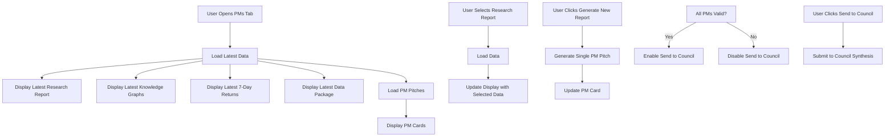

# PMs Tab GUI Modifications Plan

## Purpose
Redesign the PMs tab to improve workflow, data display, and user experience based on specific requirements.

---

## Current State Analysis

### Existing Components
- **File**: [`frontend/src/components/dashboard/tabs/PMsTab.jsx`](frontend/src/components/dashboard/tabs/PMsTab.jsx)
- **Backend**: [`backend/main.py`](backend/main.py) - `/api/pitches/generate` and `/api/pitches/status` endpoints
- **PM Models**: GPT-5.2 (CHATGPT), Gemini 3 Pro (GEMINI), Claude Sonnet 4.5 (CLAUDE), Grok 4.1 (GROQ), DeepSeek V3 (DEEPSEEK)

### Current Workflow Issues
1. "Data Package Info" box is redundant and should be removed
2. "Generate Pitches" button should be "Load Data" instead
3. No default display of latest research reports, knowledge graphs, market metrics
4. "No pitches generated" message is unnecessary
5. Cannot regenerate individual PM pitches when API fails
6. No date association between research reports and PM pitches
7. "Send to Council" button not properly enabled/disabled based on completion status

---

## Requirements Summary

### 1. Remove "Data Package Info" Element
- Remove the box listing what data is included
- This information is redundant and clutters the UI

### 2. Change "Generate Pitches" to "Load Data"
- Button should say "Load Data" instead of "Generate Pitches"
- Purpose: Load data for the selected research report

### 3. Default Display: Latest Research Report
- Always show the "Latest Research Report" by default
- Display the date of the latest report
- Research reports are generated in the Research tab

### 4. Default Display: Latest Knowledge Graphs
- Always show the "Latest Knowledge Graphs" from the database
- Display the date of the latest knowledge graphs
- Interactive visualization with filters

### 5. Default Display: Latest 7-Day Log Returns
- Always show the "Latest 7-Day Log Returns"
- Display the date of the latest returns data

### 6. Default Display: Latest Complete Data Package (JSON)
- Always show the "Latest Complete Data Package (JSON)"
- Display the date of the latest data package

### 7. Remove "No Pitches Generated" Message
- Remove the message: "No pitches generated for this report yet. Click 'Generate Pitches' above to run the portfolio manager models."
- This state should not exist

### 8. Display PM Cards with Latest Trading Outlooks
- Show cards for each PM (Gemini, Groq, Deepseek, Claude, ChatGPT)
- Display their latest trading outlook with their views
- Cards are already nicely formatted

### 9. Add "Generate New Report" Button Per PM Card
- Button under each PM card
- Purpose: Override the report with a new one
- Uses the date selected in "Select Research Report" dropdown

### 10. Individual PM Regeneration
- Allow regeneration of individual PM pitches when API fails
- Current behavior only allows generating all pitches at once

### 11. Date Association
- All generated PM reports must be associated with the date from "Select Research Report"
- Maintain relationship between research report and PM pitches

### 12. "Send to Council" Button State
- Button should be greyed out/disabled unless all PM reports are generated and valid
- Only enable when all 5 PMs have valid pitches

### 13. Send to Council Workflow
- Mechanics already working fine
- Just needs GUI cleanup

---

## Proposed New Layout

```
┌─────────────────────────────────────────────────────────────────────────┐
│  PMs TAB                                                                  │
├─────────────────────────────────────────────────────────────────────────┤
│                                                                          │
│  ┌─────────────────────────────────────────────────────────────────┐    │
│  │  Select Research Report: [Latest Research Report ▼]            │    │
│  │  Date: 2026-01-02 16:00:00 ET                                   │    │
│  └─────────────────────────────────────────────────────────────────┘    │
│                                                                          │
│  ┌─────────────────────────────────────────────────────────────────┐    │
│  │  [Load Data]                                                      │    │
│  └─────────────────────────────────────────────────────────────────┘    │
│                                                                          │
│  ┌─────────────────────────────────────────────────────────────────┐    │
│  │  LATEST RESEARCH REPORT                                          │    │
│  │  Date: 2026-01-02 16:00:00 ET                                     │    │
│  │  ┌─────────────────────────────────────────────────────────┐   │    │
│  │  │ Macro Regime: RISK_ON                                    │   │    │
│  │  │ Top Narratives:                                          │   │    │
│  │  │   1. Labor market resilience...                            │   │    │
│  │  │   2. Manufacturing recovery...                           │   │    │
│  │  │   3. Tech rotation...                                     │   │    │
│  │  │ Tradable Candidates:                                      │   │    │
│  │  │   - SPY: LONG - Equities showing strength...             │   │    │
│  │  │   - TLT: SHORT - Rates expected to rise...                │   │    │
│  │  └─────────────────────────────────────────────────────────┘   │    │
│  └─────────────────────────────────────────────────────────────────┘    │
│                                                                          │
│  ┌─────────────────────────────────────────────────────────────────┐    │
│  │  LATEST KNOWLEDGE GRAPHS                                        │    │
│  │  Date: 2026-01-02 16:00:00 ET                                     │    │
│  │  ┌─────────────────────────────────────────────────────────┐   │    │
│  │  │ [Interactive Graph Visualization]                       │   │    │
│  │  │ [Filter controls]                                        │   │    │
│  │  └─────────────────────────────────────────────────────────┘   │    │
│  └─────────────────────────────────────────────────────────────────┘    │
│                                                                          │
│  ┌─────────────────────────────────────────────────────────────────┐    │
│  │  LATEST 7-DAY LOG RETURNS                                        │    │
│  │  Date: 2026-01-02 16:00:00 ET                                     │    │
│  │  ┌─────────────────────────────────────────────────────────┐   │    │
│  │  │ SPY: +2.34%  QQQ: +3.12%  IWM: +1.87%  TLT: -0.45%      │   │    │
│  │  │ HYG: +0.78%  UUP: +0.12%  GLD: +1.23%  USO: -2.34%      │   │    │
│  │  │ VIXY: -5.67%  SH: -2.34%                                  │   │    │
│  │  └─────────────────────────────────────────────────────────┘   │    │
│  └─────────────────────────────────────────────────────────────────┘    │
│                                                                          │
│  ┌─────────────────────────────────────────────────────────────────┐    │
│  │  LATEST COMPLETE DATA PACKAGE (JSON)                             │    │
│  │  Date: 2026-01-02 16:00:00 ET                                     │    │
│  │  ┌─────────────────────────────────────────────────────────┐   │    │
│  │  │ [Collapsible JSON display]                             │   │    │
│  │  └─────────────────────────────────────────────────────────┘   │    │
│  └─────────────────────────────────────────────────────────────────┘    │
│                                                                          │
│  ┌─────────────────────────────────────────────────────────────────┐    │
│  │  PM TRADING OUTLOOKS                                              │    │
│  ├─────────────────────────────────────────────────────────────────┤    │
│  │  ┌─────────────┐  ┌─────────────┐  ┌─────────────┐              │    │
│  │  │ GPT-5.2     │  │ Gemini 3 Pro│  │ Claude 4.5  │              │    │
│  │  │ CHATGPT     │  │ GEMINI      │  │ CLAUDE      │              │    │
│  │  ├─────────────┤  ├─────────────┤  ├─────────────┤              │    │
│  │  │ Instrument: │  │ Instrument: │  │ Instrument: │              │    │
│  │  │ SPY         │  │ QQQ         │  │ TLT         │              │    │
│  │  │ Direction:  │  │ Direction:  │  │ Direction:  │              │    │
│  │  │ LONG        │  │ LONG        │  │ SHORT       │              │    │
│  │  │ Conviction: │  │ Conviction: │  │ Conviction: │              │    │
│  │  │ +1.5        │  │ +2.0        │  │ -1.0        │              │    │
│  │  │ Thesis:     │  │ Thesis:     │  │ Thesis:     │              │    │
│  │  │ • Strong... │  │ • Tech...   │  │ • Rates...  │              │    │
│  │  │ • Momentum  │  │ • Growth... │  │ • Inflation │              │    │
│  │  │ • Volume... │  │ • AI...     │  │ • Fed...    │              │    │
│  │  ├─────────────┤  ├─────────────┤  ├─────────────┤              │    │
│  │  │[Generate New│  │[Generate New│  │[Generate New│              │    │
│  │  │ Report]     │  │ Report]     │  │ Report]     │              │    │
│  │  └─────────────┘  └─────────────┘  └─────────────┘              │    │
│  │  ┌─────────────┐  ┌─────────────┐                              │    │
│  │  │ Grok 4.1    │  │ DeepSeek V3 │                              │    │
│  │  │ GROQ        │  │ DEEPSEEK    │                              │    │
│  │  ├─────────────┤  ├─────────────┤                              │    │
│  │  │ Instrument: │  │ Instrument: │                              │    │
│  │  │ GLD         │  │ USO         │                              │    │
│  │  │ Direction:  │  │ Direction:  │                              │    │
│  │  │ LONG        │  │ SHORT       │                              │    │
│  │  │ Conviction: │  │ Conviction: │                              │    │
│  │  │ +0.5        │  │ -1.5        │                              │    │
│  │  │ Thesis:     │  │ Thesis:     │                              │    │
│  │  │ • Safe...   │  │ • Oil...    │                              │    │
│  │  │ • Inflation │  │ • Supply... │                              │    │
│  │  │ • Fed...    │  │ • Demand... │                              │    │
│  │  ├─────────────┤  ├─────────────┤                              │    │
│  │  │[Generate New│  │[Generate New│                              │    │
│  │  │ Report]     │  │ Report]     │                              │    │
│  │  └─────────────┘  └─────────────┘                              │    │
│  └─────────────────────────────────────────────────────────────────┘    │
│                                                                          │
│  ┌─────────────────────────────────────────────────────────────────┐    │
│  │  [Send to Council]                                                │    │
│  │  (greyed out unless all 5 PMs have valid reports)                 │    │
│  └─────────────────────────────────────────────────────────────────┘    │
│                                                                          │
└─────────────────────────────────────────────────────────────────────────┘
```

---

## Implementation Plan

### Phase 1: Frontend Component Updates

#### 1.1 Update PMsTab.jsx - Remove Data Package Info
**File**: [`frontend/src/components/dashboard/tabs/PMsTab.jsx`](frontend/src/components/dashboard/tabs/PMsTab.jsx)

**Changes**:
- Remove the "Data Package Info" div element
- Remove the box listing what data is included

**Code to remove**:
```jsx
<div className="rounded-lg border bg-card text-card-foreground shadow-sm p-4">
  <h3 className="text-sm font-semibold mb-3">Data Package Info</h3>
  <div className="p-3 rounded-lg border border-dashed border-border/60 bg-muted/5 text-xs text-muted-foreground">
    <p className="leading-relaxed font-semibold mb-2">Includes:</p>
    <ul className="list-disc list-inside space-y-1">
      <li>Research report (natural language + structured)</li>
      <li>7-day log returns for all 10 securities</li>
      <li>30-day correlation matrix (10x10)</li>
      <li>Current prices & volumes</li>
      <li>Event calendar with impact ratings</li>
      <li>Macro knowledge graph digest</li>
    </ul>
  </div>
</div>
```

#### 1.2 Update PMsTab.jsx - Change Button Text
**Changes**:
- Change "Generate Pitches" button text to "Load Data"
- Update button handler to load data for selected research report

**Code change**:
```jsx
// Before:
<button onClick={handlePassToPMs}>Generate Pitches</button>

// After:
<button onClick={handleLoadData}>Load Data</button>
```

#### 1.3 Update PMsTab.jsx - Default Display Logic
**Changes**:
- On component mount, automatically load latest data
- Display latest research report by default
- Display latest knowledge graphs by default
- Display latest 7-day log returns by default
- Display latest complete data package by default

**New state variables**:
```jsx
const [latestResearchReport, setLatestResearchReport] = useState(null);
const [latestKnowledgeGraphs, setLatestKnowledgeGraphs] = useState(null);
const [latestReturns, setLatestReturns] = useState(null);
const [latestDataPackage, setLatestDataPackage] = useState(null);
```

**New functions**:
```jsx
const loadLatestData = async () => {
  // Load latest research report
  const researchResponse = await fetch('/api/research/latest');
  const researchData = await researchResponse.json();
  setLatestResearchReport(researchData);

  // Load latest knowledge graphs
  const graphResponse = await fetch('/api/graphs/latest');
  const graphData = await graphResponse.json();
  setLatestKnowledgeGraphs(graphData);

  // Load latest 7-day returns
  const returnsResponse = await fetch('/api/metrics/returns/latest');
  const returnsData = await returnsResponse.json();
  setLatestReturns(returnsData);

  // Load latest complete data package
  const packageResponse = await fetch('/api/data-package/latest');
  const packageData = await packageResponse.json();
  setLatestDataPackage(packageData);
};
```

**UseEffect**:
```jsx
useEffect(() => {
  loadLatestData();
}, []);
```

#### 1.4 Update PMsTab.jsx - Remove "No Pitches" Message
**Changes**:
- Remove the conditional rendering of "No pitches generated" message
- Always show PM cards (even if empty or loading)

**Code to remove**:
```jsx
{!pitches || pitches.length === 0 && (
  <div className="text-center py-8 text-muted-foreground">
    No pitches generated for this report yet.
    Click "Generate Pitches" above to run the portfolio manager models.
  </div>
)}
```

#### 1.5 Update PMsTab.jsx - PM Cards Display
**Changes**:
- Always display PM cards with latest trading outlooks
- Each card shows instrument, direction, conviction, thesis bullets
- Cards are already nicely formatted, just ensure they always display

**Existing card structure** (keep as-is):
```jsx
{pmModels.map((model) => (
  <PMPitchCard
    key={model.key}
    model={model}
    pitch={pitches.find(p => p.pm_model === model.key)}
    onRegenerate={() => handleRegeneratePitch(model.key)}
  />
))}
```

#### 1.6 Update PMsTab.jsx - Add "Generate New Report" Button
**Changes**:
- Add "Generate New Report" button under each PM card
- Button calls individual PM pitch generation
- Uses the date selected in "Select Research Report" dropdown

**New function**:
```jsx
const handleGenerateNewReport = async (modelKey) => {
  const selectedResearchDate = selectedReport?.date;
  
  const response = await fetch('/api/pitches/generate', {
    method: 'POST',
    headers: { 'Content-Type': 'application/json' },
    body: JSON.stringify({
      model: modelKey,
      research_date: selectedResearchDate
    })
  });
  
  // Handle response and update state
};
```

**Update PMPitchCard component**:
```jsx
// Add button to card footer
<button onClick={() => onGenerateNewReport(model.key)}>
  Generate New Report
</button>
```

#### 1.7 Update PMsTab.jsx - Individual PM Regeneration
**Changes**:
- Allow regeneration of individual PM pitches
- Current behavior only allows generating all pitches at once
- Update backend call to support single model generation

**Backend endpoint already supports**:
```python
# backend/main.py - generate_pitches endpoint
target_models = [request.model] if request.model else ["chatgpt", "gemini", "claude", "groq", "deepseek"]
```

**Frontend update**:
```jsx
const handleRegeneratePitch = async (modelKey) => {
  const response = await fetch('/api/pitches/generate', {
    method: 'POST',
    headers: { 'Content-Type': 'application/json' },
    body: JSON.stringify({
      model: modelKey,  // Single model only
      research_date: selectedReport?.date
    })
  });
  
  // Poll for status
  const { job_id } = await response.json();
  startPolling(job_id, [modelKey]);
};
```

#### 1.8 Update PMsTab.jsx - Date Association
**Changes**:
- All generated PM reports must be associated with the date from "Select Research Report"
- Maintain relationship between research report and PM pitches
- Store research_date in pitch data

**Data structure update**:
```jsx
const [pitches, setPitches] = useState([
  {
    pm_model: "chatgpt",
    research_date: "2026-01-02",  // Associated with research report
    selected_instrument: "SPY",
    direction: "LONG",
    conviction: 1.5,
    thesis_bullets: [...],
    // ... other fields
  },
  // ... other PMs
]);
```

#### 1.9 Update PMsTab.jsx - "Send to Council" Button State
**Changes**:
- Button should be greyed out/disabled unless all PM reports are generated and valid
- Only enable when all 5 PMs have valid pitches
- Check that all pitches exist and are valid

**Validation logic**:
```jsx
const allPitchesValid = () => {
  return pmModels.every(model => {
    const pitch = pitches.find(p => p.pm_model === model.key);
    return pitch && pitch.status !== 'error';
  });
};
```

**Button rendering**:
```jsx
<button
  onClick={handlePassToCouncil}
  disabled={!allPitchesValid()}
  className={!allPitchesValid() ? 'opacity-50 cursor-not-allowed' : ''}
>
  Send to Council
</button>
```

#### 1.10 Update PMsTab.jsx - Send to Council Workflow
**Changes**:
- Mechanics already working fine
- Just ensure GUI is clean and button state is correct

**Existing function** (keep as-is):
```jsx
const handlePassToCouncil = async () => {
  const response = await fetch('/api/council/synthesize', {
    method: 'POST',
    headers: { 'Content-Type': 'application/json' },
    body: JSON.stringify({
      research_date: selectedReport?.date,
      pitches: pitches
    })
  });
  
  // Handle response
};
```

### Phase 2: Backend API Updates

#### 2.1 Add "Latest Data" Endpoints
**File**: [`backend/main.py`](backend/main.py)

**New endpoints needed**:

```python
@app.get("/api/research/latest")
async def get_latest_research():
    """Get the latest research report from database."""
    # Query database for latest research report
    # Return research data with date
    pass

@app.get("/api/graphs/latest")
async def get_latest_graphs():
    """Get the latest knowledge graphs from database."""
    # Query database for latest knowledge graphs
    # Return graph data with date
    pass

@app.get("/api/metrics/returns/latest")
async def get_latest_returns():
    """Get the latest 7-day log returns."""
    # Query database for latest 7-day returns
    # Return returns data with date
    pass

@app.get("/api/data-package/latest")
async def get_latest_data_package():
    """Get the latest complete data package."""
    # Query database for latest data package
    # Return complete data package with date
    pass
```

#### 2.2 Update Generate Pitches Endpoint
**File**: [`backend/main.py`](backend/main.py)

**Changes**:
- Ensure research_date is stored with each pitch
- Return pitch data with research_date association

**Existing endpoint** (update):
```python
@app.post("/api/pitches/generate")
async def generate_pitches(background_tasks: BackgroundTasks, request: GeneratePitchesRequest):
    # ... existing code ...
    
    # Ensure research_date is stored
    for pitch in pm_pitches:
        pitch['research_date'] = request.research_date or datetime.now().isoformat()
    
    # ... existing code ...
```

#### 2.3 Update Get Pitches Endpoint
**File**: [`backend/main.py`](backend/main.py)

**Changes**:
- Filter pitches by research_date
- Return only pitches associated with selected research report

**New endpoint or update existing**:
```python
@app.get("/api/pitches")
async def get_pitches(research_date: str = None):
    """Get PM pitches, optionally filtered by research_date."""
    if research_date:
        # Filter by research_date
        pitches = query_pitches_by_date(research_date)
    else:
        # Get latest pitches
        pitches = query_latest_pitches()
    
    return {"pitches": pitches}
```

### Phase 3: Database Schema Updates

#### 3.1 Add research_date Column to PM Pitches Table
**File**: Backend database schema

**Changes**:
- Add `research_date` column to PM pitches table
- Index on `research_date` for efficient filtering

**SQL**:
```sql
ALTER TABLE pm_pitches ADD COLUMN research_date TEXT;
CREATE INDEX idx_pm_pitches_research_date ON pm_pitches(research_date);
```

### Phase 4: Testing and Validation

#### 4.1 Unit Tests
- Test default data loading on component mount
- Test individual PM pitch regeneration
- Test date association between research and pitches
- Test "Send to Council" button enable/disable logic

#### 4.2 Integration Tests
- Test complete workflow from research selection to council submission
- Test API failures and error handling
- Test data persistence across page refreshes

#### 4.3 UI/UX Testing
- Verify all default data displays correctly
- Verify PM cards always display
- Verify buttons work as expected
- Verify responsive design

---

## Data Flow Diagram



---

## Component Structure

```
PMsTab.jsx
├── Header
│   ├── Title: "PMs TAB"
│   └── Select Research Report Dropdown
│
├── Load Data Button
│
├── Latest Research Report Section
│   ├── Date Display
│   └── Research Content (Macro Regime, Narratives, Candidates)
│
├── Latest Knowledge Graphs Section
│   ├── Date Display
│   └── Interactive Graph Visualization
│
├── Latest 7-Day Log Returns Section
│   ├── Date Display
│   └── Returns Grid
│
├── Latest Complete Data Package Section
│   ├── Date Display
│   └── Collapsible JSON Display
│
├── PM Trading Outlooks Section
│   ├── PM Card 1 (GPT-5.2)
│   │   ├── Instrument, Direction, Conviction
│   │   ├── Thesis Bullets
│   │   └── Generate New Report Button
│   ├── PM Card 2 (Gemini 3 Pro)
│   │   └── ...
│   ├── PM Card 3 (Claude 4.5)
│   │   └── ...
│   ├── PM Card 4 (Grok 4.1)
│   │   └── ...
│   └── PM Card 5 (DeepSeek V3)
│       └── ...
│
└── Send to Council Button
    └── Disabled unless all PMs have valid reports
```

---

## API Endpoints Summary

### New Endpoints Required
1. `GET /api/research/latest` - Get latest research report
2. `GET /api/graphs/latest` - Get latest knowledge graphs
3. `GET /api/metrics/returns/latest` - Get latest 7-day returns
4. `GET /api/data-package/latest` - Get latest complete data package
5. `GET /api/pitches?research_date={date}` - Get pitches by research date

### Existing Endpoints to Update
1. `POST /api/pitches/generate` - Ensure research_date is stored
2. `GET /api/pitches/status` - Poll for individual PM status

---

## Priority Order

1. **High Priority** (Core functionality):
   - Remove "Data Package Info" element
   - Change "Generate Pitches" to "Load Data"
   - Default display of latest data
   - Remove "No pitches" message
   - Display PM cards with latest outlooks

2. **Medium Priority** (Enhanced functionality):
   - Add "Generate New Report" button per PM card
   - Individual PM regeneration
   - Date association
   - "Send to Council" button state

3. **Low Priority** (Backend support):
   - Add "latest data" endpoints
   - Update database schema
   - Update existing endpoints

---

## Success Criteria

- [ ] "Data Package Info" element removed
- [ ] Button text changed to "Load Data"
- [ ] Latest research report displays by default with date
- [ ] Latest knowledge graphs display by default with date
- [ ] Latest 7-day returns display by default with date
- [ ] Latest data package displays by default with date
- [ ] "No pitches generated" message removed
- [ ] PM cards always display with latest outlooks
- [ ] "Generate New Report" button under each PM card
- [ ] Individual PM regeneration works
- [ ] PM pitches associated with research date
- [ ] "Send to Council" button properly enabled/disabled
- [ ] Send to Council workflow works correctly

---

## Notes

- All changes should maintain existing functionality where possible
- Use existing PM card formatting (already nicely formatted)
- Ensure responsive design is maintained
- Test thoroughly with different data states
- Consider error handling for API failures
- Maintain session storage for state persistence
