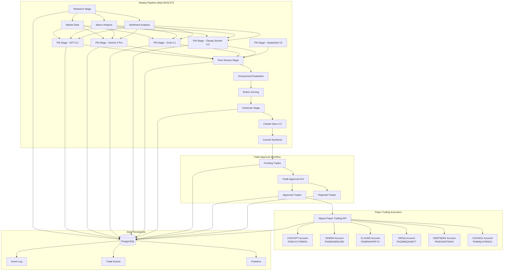
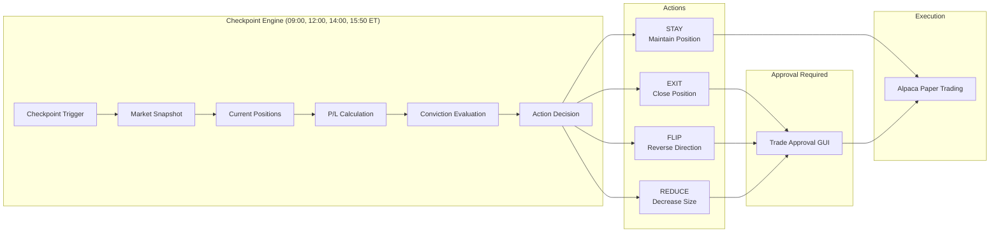
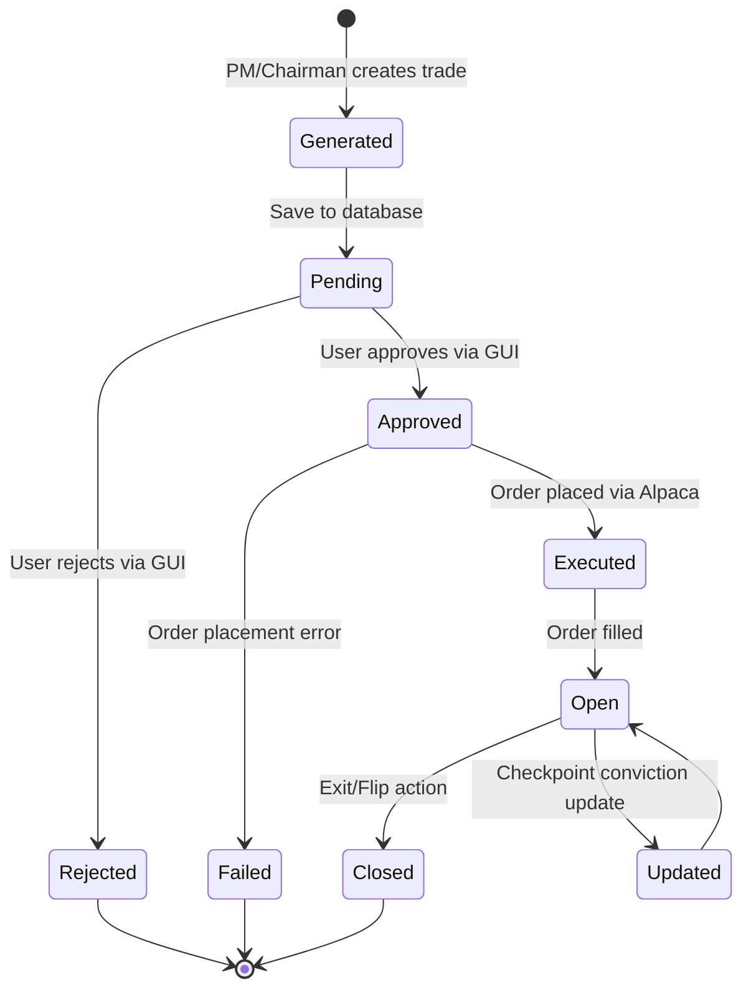
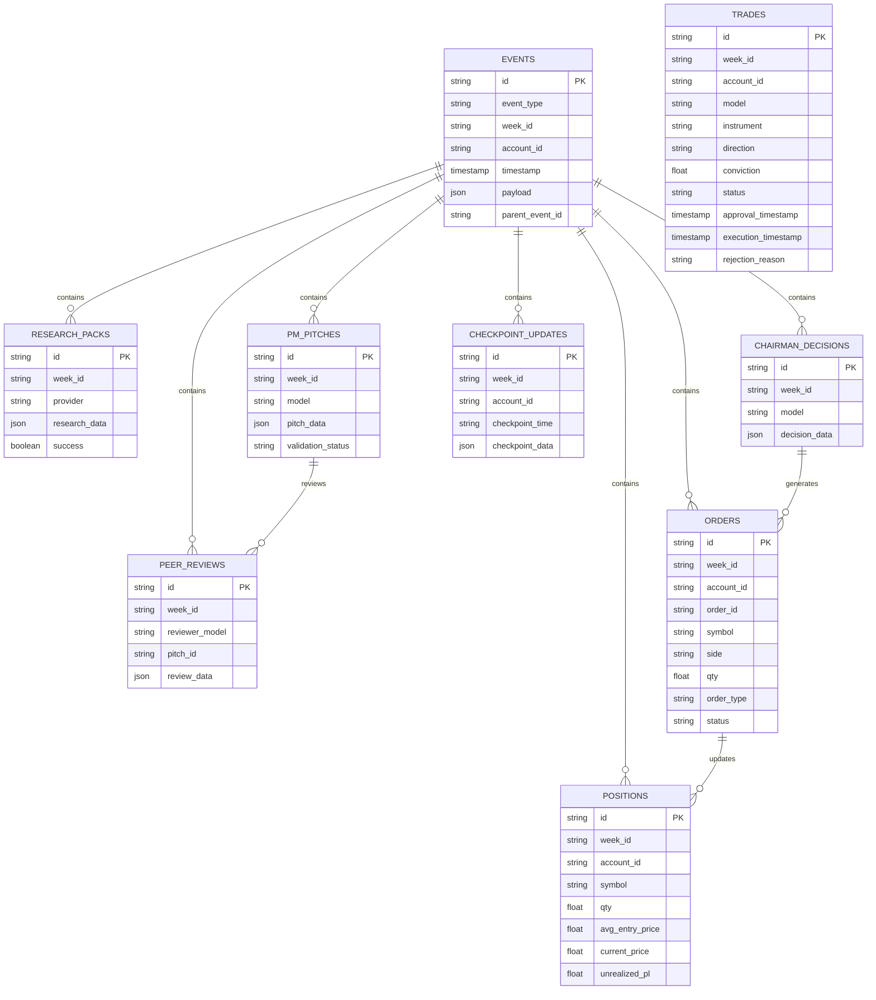
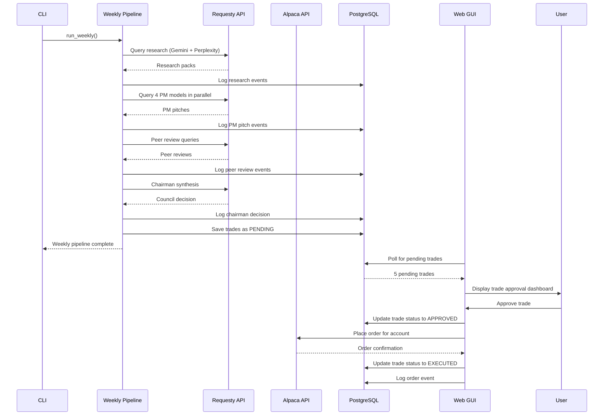
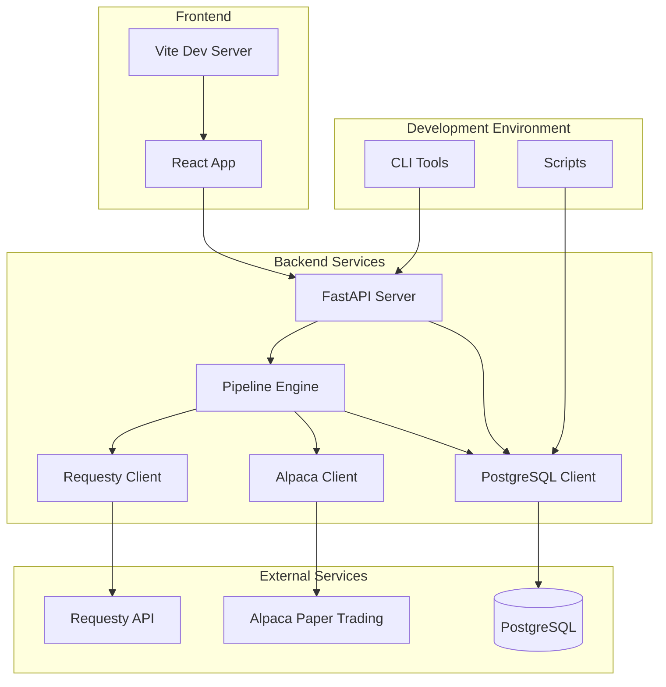

# LLM Trading - Architecture Diagrams

## System Architecture

## Daily Checkpoint Flow

## Trade Lifecycle State Machine

## Database Schema

## Component Interaction

## Deployment Architecture

## Data Flow Summary

### Research Flow
1. **Market Data** → Alpaca API → Research Stage
2. **Macro Analysis** → Requesty API → Research Pack A/B
3. **Sentiment** → Requesty API → Research Pack A/B
4. **Research Packs** → PostgreSQL → Event Log

### PM Flow
1. **Research Packs** → PM Stage (4 models)
2. **PM Models** → Requesty API (parallel queries)
3. **PM Pitches** → PostgreSQL → Event Log

### Peer Review Flow
1. **PM Pitches** → Peer Review Stage
2. **Anonymization** → Remove model identities
3. **Peer Review Queries** → Requesty API (4 models)
4. **Peer Reviews** → PostgreSQL → Event Log

### Chairman Flow
1. **PM Pitches + Peer Reviews** → Chairman Stage
2. **Chairman Model** → Requesty API (Claude Sonnet 4.5)
3. **Council Decision** → PostgreSQL → Event Log

### Approval Flow
1. **Council Decision** → Save as PENDING
2. **GUI Poll** → Fetch pending trades
3. **User Review** → Approve/Reject
4. **Approved Trades** → Alpaca API → Execute
5. **Rejected Trades** → Log rejection reason

### Checkpoint Flow
1. **Scheduled Time** → Checkpoint Trigger
2. **Market Snapshot** → Alpaca API
3. **Position + P/L** → Alpaca API
4. **Conviction Eval** → Requesty API
5. **Action Decision** → Approve if not STAY
6. **Execute** → Alpaca API
